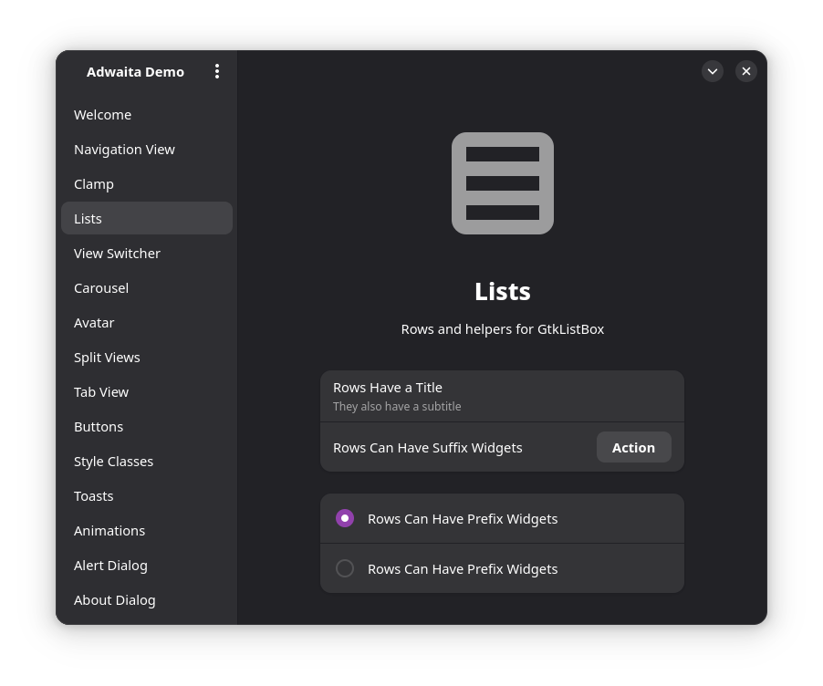
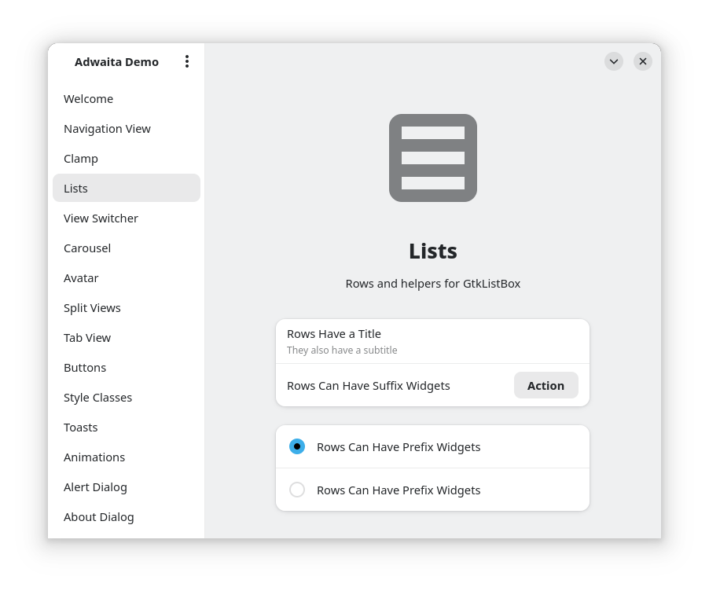
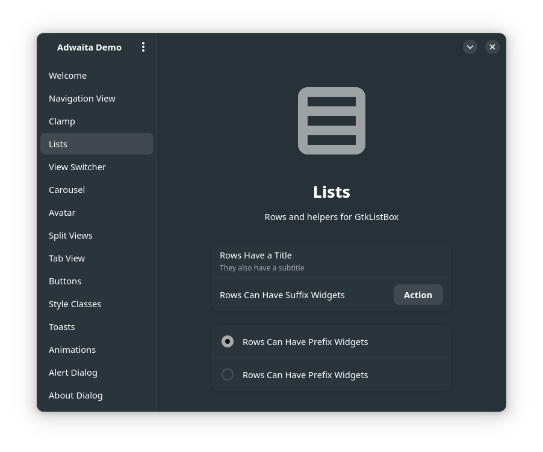
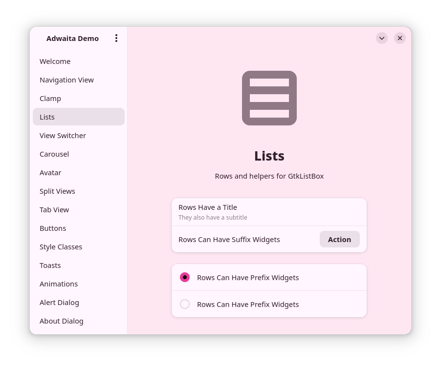

## KDE Color Scheme for Adwaita/adw-gtk3
Uses the color scheme set by KDE and makes it work with Adwaita.

You might want to use this if you're using a different application style than Breeze and want a more uniform look. Or you can just use this to get uniform colors on libadwaita apps by only installing for GTK4.

The 'gtk.css' files were generated from cosmic-settings, then mapped to 'colors.css' generated by KDE. There's likely more color variables that can be set in Adwaita, but I haven't looked into that yet.

<br/>

### Without GTK Config:
##
<p align="left">
    
</p>

### With GTK config:
##
#### Breeze Light color scheme:
<p align="left">
    
</p>

#### Adapta color scheme:
<p align="left">
    
</p>

</p>

#### Light theme tinted by accent color:
<p align="left">
    
</p>

### Installation
❗ If you have any custom gtk.css in ```~/.config/gtk-3.0``` or ```~/.config/gtk-4.0``` make sure to back it up.
```
git clone https://github.com/chikenpotpi/adwaita-kde-colors.git
cd ./adwaita-kde-colors
chmod +x ./install.sh
./install.sh
```
Then select an install option by typing 1, 2, or 3.

### Flatpaks
For flatpak applications you need to set a global override:
```
flatpak override --user --filesystem=xdg-config/gtk-3.0
flatpak override --user --filesystem=xdg-config/gtk-4.0
```

### Live color changing
GTK3 applications (such as firefox) can have their colors changed without the need to restart them.

This can be done by setting: ```GTK_MODULES=colorreload-gtk-module``` as an environment variable. You can learn how to do this for KDE [here](https://wiki.archlinux.org/title/Environment_variables#Per_Wayland_session).

Unforntunately this doesn't apply to GTK4/libadwaita applications, and I don't know of a way to reload color schemes for those applications.
